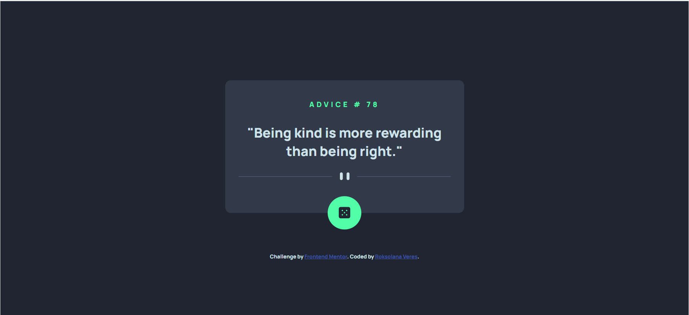
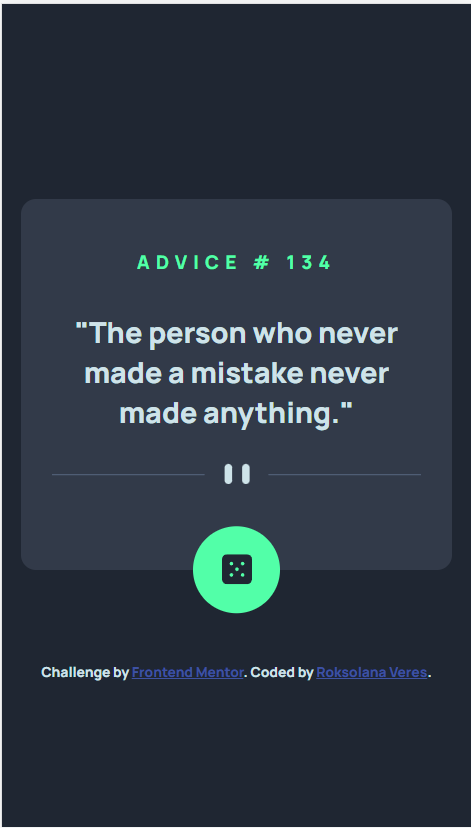

# Frontend Mentor - Advice generator app solution

This is a solution to the [Advice generator app challenge on Frontend Mentor](https://www.frontendmentor.io/challenges/advice-generator-app-QdUG-13db). Frontend Mentor challenges help you improve your coding skills by building realistic projects.

## Table of contents

- [Overview](#overview)
  - [The challenge](#the-challenge)
  - [Screenshots](#screenshots)
  - [Links](#links)
- [My process](#my-process)
  - [Built with](#built-with)
  - [What I learned](#what-i-learned)
- [Author](#author)

## Overview

### The challenge

Users should be able to:

- View the optimal layout for the app depending on their device's screen size
- See hover states for all interactive elements on the page
- Generate a new piece of advice by clicking the dice icon

### Screenshots

### Links

- [Frontend Mentor solution](https://www.frontendmentor.io/solutions/responsive-intro-section-with-mobilefirst-approach-oEYud8fG_K)
- [GitHub repo](https://github.com/RoksolanaVeres/Advice-generator_app)
- [Live Site](https://roksolanaveres.github.io/Advice-generator_app/)

## My process

### Built with

- Semantic HTML5 markup
- BEM naming approach
- Flexbox
- Mobile-first workflow

### What I learned

- Learned how to use variables in CSS for colors
- Practiced the work with API using fetch()

## Author

- Frontend Mentor - [@RoksolanaVeres](https://www.frontendmentor.io/profile/RoksolanaVeres)
